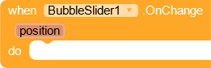
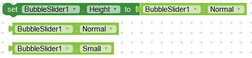
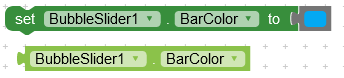
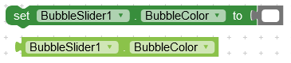
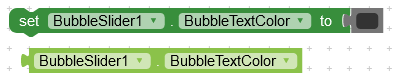
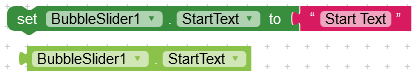
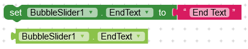
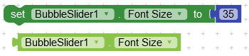
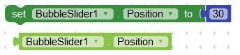
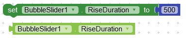

## Download

---

 

AIX: [Kodular Community](https://community.kodular.io/t/bubble-slider-a-slider-widget-with-a-popup-bubble-displaying-the-precise-value-selected/132204)

AIA: [Kodular Community](https://community.kodular.io/t/bubble-slider-a-slider-widget-with-a-popup-bubble-displaying-the-precise-value-selected/132204)

## Functions

---

### Create Slider

Create slider in a layout.

**_layout :_** arrangement

## Events

---

### On Change

Event raised when slider position changes.

**_position :_** current slider position

## Properties

---

### Height

Set height for slider. You need to assign this value before using the create block. Else it will not work.

### Bar Color

Set background color of bar.

### Bubble Color

Color of circular _bubble_ inside bar.

### Bar Text Color

Color of start and end texts of slider.

### Bubble Text Color

Color of text inside _bubble_.

### Start Text

Start (left) text of slider.

### End Text

End (right) text of slider.

### Font Size

### Postion

Positon of _bubble_ in range form 0 to 100.

### Rise Duration

Duration of _bubble_ rise in milliseconds.

