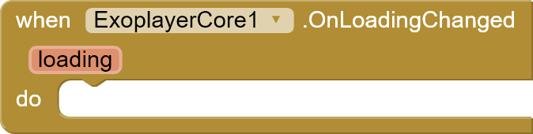
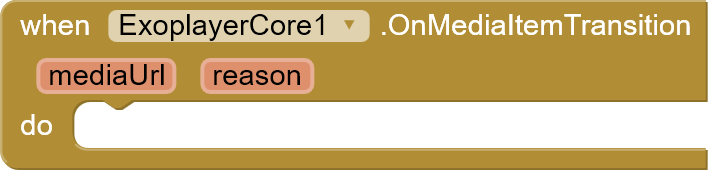

## Download

---

 

AIX: [Github](https://github.com/zainulhassan815/exoplayer-appinventor/tree/main/exoplayer-core/out)

AIA: [Github](https://github.com/zainulhassan815/exoplayer-appinventor/blob/main/aia/exoplayer_with_title.aia)

## Functions

---

### Create Player

Create and initialize player. Must be called before using with Exoplayer UI.

### Get Exoplayer Instance

Returns the Exoplayer instance that you can use in _Exoplayer UI - CreatePlayer_

### Add Media

Add a new media item to playlist. You can use this block to add multiple media items which are then managed by the player in the form of playlist.

_path:_ path to media

_subtitles:_ list of subtitles

### Remove Media

Remove media item at specific index from playlist.

_index :_ Index at which you want to remove media item

### Clear Media Items

Remove all media items from playlist.

### Play

Start media playback.

### Pause

Pause media playback.

### Stop

Stop current media item.

### Seek To

Seek to specific milliseconds.

_position :_ milliseconds

### Format

Convert milliseconds to hh:mm:ss format.

_mills :_ milliseconds

## Events

---

### On Render First Frame

Event raised when player has rendered first media frame.

### On State Changed

Event raised when player state changes.

_state :_ integer representing current state of player that you can compare it with Player States and perform suitable function

### On Is Playing Changed

Event raised when current playing state changes.

_isPlaying :_ boolean

### On Loading Change

Event raised when loading state changes.

_loading :_ boolean

### On Media Item Transition

Event raised when media item is changed. Basically when current video/audio is changed and player opens next media item from playlist.

_mediaUrl :_ media url

_reason :_ integer representing transition reason that you can compare with Transition Reason Getters and perform suitable functions.

### On Metadata Changed

Event raised when media metadata changes. You get a JSON response.

_data :_ JSON response that you can manipulate using dictionaries

### On Repeat Mode Changed

Event raised when repeat mode changes.

_repeatMode :_ integer representing RepeatMode that you can compare with RepeatModes properties and perform function as per your requirement

### On Shuffle Mode Enabled Changed

Event raised when shuffle mode changes.

_enabled :_ boolean

### On Video Size Changed

Event raised when video size is changed or first measured.

_width :_ video width in pixels

_height :_ video height in pixels

_pixelRatio :_ video size ratio

_unAppliedRotationDegrees :_ degrees in float

### On Volume Changed

Event raised when device volume changes.

_volume :_ device volume (integer)

_isMuted :_ boolean

### On Error

Event raised when there is an error during media playback. Currently the block is not very efficient as it doesn’t provide proper detail for error. In the next version, I will try to error codes and respective error messages.

_error :_ error message

## Properties

---

### Set Repeat

Set repeat modes for player.

### Play When Ready

Set whether to automatically play when player is ready or not.

### Media Duration

### Current Position

### Buffered Location

### Is Loading

### Is Playing

### SelectionFlags

These are used when adding subtitles.

## Fix Common Issues

---

### 1- Player won't work after screen off or app is minimized

You can easily fix this issue by using the blocks given below :

> 

### 2- How to add subtitles

> 

Add a new media item to playlist. You can use this block to add multiple media items which are then managed by the player in the form of playlist. For subtitles, you need to pass in a list of subtitles. Below is a detailed guide for adding subtitles.

To add subtitles there are two ways :

**Dictionary Block**

> 

You can pass a list of subtitles by using dictionary blocks.
Here only two parameters are required :

- path
- mime_type

And the rest of the parameters are optional and you can skip them.

**JSON String**

> 
>
> 
>
> 
