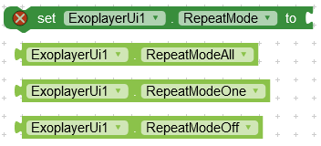
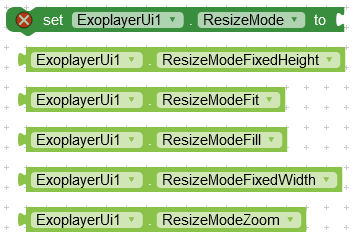
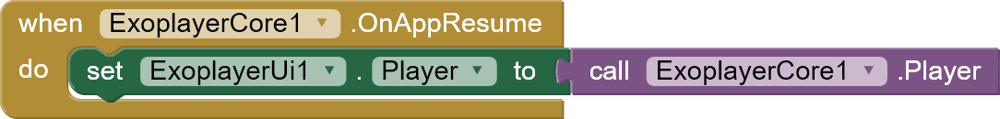

## Download

---

 

AIX: [Github](https://github.com/zainulhassan815/exoplayer-appinventor/tree/main/exoplayer-ui/out)

AIA: [Github](https://github.com/zainulhassan815/exoplayer-appinventor/blob/main/aia/exoplayer_with_title.aia)

Upload Icons: [Icons.zip](https://downgit.github.io/#/home?url=https://github.com/zainulhassan815/exoplayer-appinventor/tree/main/images/upload-icons)

## Functions

---

### Create Simple Player

Create player view in a layout with basic controls.

**_layout :_** horizontal or vertical arrangement

**_exoplayer :_** exoplayer instance from Core Library

### Create Styled Player

Create player view in a layout with extra controls like toggle captions, track selection etc.

_layout :_ horizontal or vertical arrangement

_exoplayer :_ exoplayer instance from Core Library

### Show Controls

Show player controls.

### Hide Controls

Hide player controls.

### Show System UI

Can be used to exit fullscreen. The function is in experimental phase and may not work properly.

### Hide System UI

Can be used to enter fullscreen. The function is in experimental phase and may not work properly.

## Events

---

### On Fullscreen Changed

Event raised when fullscreen button is clicked and its status changes. Here you can perform different functions to enter or exit fullscreen.

_isFullscreen :_ boolean

**Sample Usage**

### On Visibility Changed

Event raised when controls visibility changes. Here you can update your UI. For example : You can show/hide a title label etc.

**_visible :_** boolean

## Properties

---

### Use Artwork

Set whether to show an image when playing an audio file.

### Default Thumbnail

Set default thumbnail in case if there is no thumbnail in media metadata, the player will show this thumbnail. It works only for audio files.

### Set Repeat Modes

Set repeat toggle modes. This will show/hide repeat toggle button.

### Show Loading

Set when to show loading progress indicator.

### Resize Mode

Set video resize mode.

### Auto Show Controller

Automatically show controller when media is interupted during playback.

### Controller Timeout

Milliseconds after which the controller should hide automatically.

### Hide On Touch

Automatically hide controller on touch

### Use Controller

Whether to use default controller or not.

### Animation Enabled

Enable/Disable controls animation.

## Track Properties

---

### Thumb Size

Thumb size when slider is visible but is not being dragged.

### Active Thumb Size

Thumb size when slider is being dragged by the user.

### Disabled Thumb Size

Thumb size when slider is disabled.

### Track Color

### Buffered Track Color

### Track Progress Color

## Subtitle Properties

---

### Subtitles Background Color

Set background color for subtitles.

### Subtitles Foreground Color

Set text or foreground color for subtitles.

### Subtitles Edge Color

Set edge color for subtitles. I am not quite sure what it does, so you can experiment with this to find out more about it.

### Subtitles Window Color

Set color for whole subtitle layout.

### Text Size Type

Specify how you want to scale subtitles font size.

### Subtitle Render View Type

Specify what type of view to use for rendering subtitles.

### Subtitle Edge Type

### Subtitle Bottom Padding

Set bottom padding for subtitles.

### Ignore Bottom Padding

### Subtitles Typeface

Specify a custom font for subtitles.

## Fix Common Issues

---

### 1- Player won't work after screen off or app is minimized

You can easily fix this issue by using the blocks given below :

