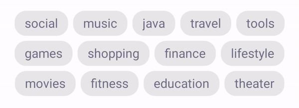
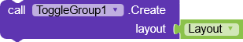
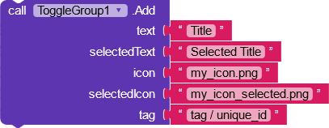
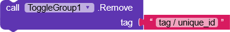
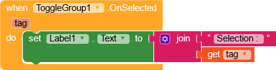
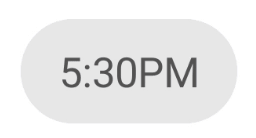
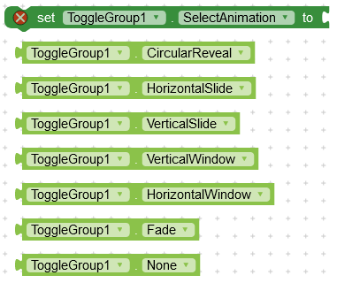
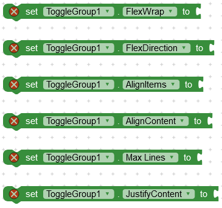

It can be configured for single selection or multi selection. For multi selection the minimum/maximum amount of buttons that are required/enabled can be specified. Icon’s can be added. Selection includes a fun press and circular reveal animation.

## Download

---

 

AIX: [Github](https://github.com/zainulhassan815/toggle-button-group-appinventor/tree/main/out)

## Functions

---

### Create

Create button container in a layout.

**_layout :_** arrangement

### Add

Add a new button to the group. If no selected text is provided then default text is used. If no selected icon is provided then default icon is used.

**_text :_** title

**_selectedText :_** selected title

**_icon :_** asset image

**_selectedIcon :_** selected asset icon

**_tag :_** unique id or tag

### Remove Button

Remove button from group.

**_tag :_** unique id or tag

## Events

---

### On Selected

Event raised when item is selected.

**_tag :_** unique id or tag of selected button

## Properties

---

### Select Animation

You can use any of these animations :

| CircularReveal                     | Fade                    | HorizontalSlide                     |
| ---------------------------------- | ----------------------- | ----------------------------------- |
|  |  |  |

| VerticalSlide                     | HorizontalWindow                     | VerticalWindow                     |
| --------------------------------- | ------------------------------------ | ---------------------------------- |
|  |  |  |

### Selectable Amount

Maximum number of items that can be selected. Default value is 1.

### Required Amount

Required selection amount. Default value is 1.

### Spacing

Item spacing. Default is 8.

### Flex Properties

Read detailed guide here : [CSS Flex Box](https://community.kodular.io/t/flexbox-css-flexible-box-layout-module-for-kodular/132608)

### Font

Custom font for text. Upload font as asset.

### Font Size

### Text Color

### Selected Text Color

### Horizontal Text Padding

### Vertical Text Padding

### Background Color

### Selected Background Color

### Icon Size

### Icon Spacing

### Border Radius

### Border Width

### Selected Border Width

### Border Color

### Selected Border Color

